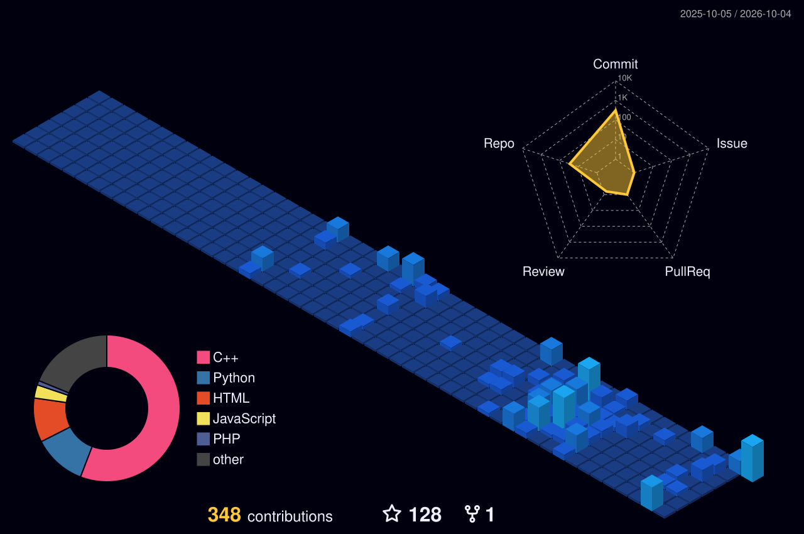

<!-- 🎬 HERO — video intro + name -->

  

<!-- 👩‍💻 LEFT: what I build   •   🏃 RIGHT: life outside code -->

  

<!-- ⚛️ TECH STACK -->

  

<!-- 🪪 DEVELOPER ID + DASHBOARD -->

  

## 🎌 Featured builds

| Project | What it is | Stack | Stars |
|:---|:---|:---|:---:|
| [**Socratic Tutoring System**](https://github.com/SanjanaGadamsetty/Socratic-Tutoring-System) | AI-powered tutoring system using Socratic method for personalized learning | `Python` `AI/ML` `NLP` | ⭐ |
| [**Aisle Manager**](https://github.com/SanjanaGadamsetty/aisle-manager) | Smart inventory management system for retail operations | `Python` `Flask` `MySQL` | ⭐ |
| [**HP Portfolio**](https://github.com/SanjanaGadamsetty/SanjanaGadamsetty-HP-Portfolio) | Harry Potter-themed personal portfolio with magical animations | `HTML` `CSS` `JavaScript` | ⭐ |
| [**Secure Document Vault**](https://github.com/SanjanaGadamsetty/Secure-Document-Vault) | Encrypted document storage with secure authentication | `Python` `Cryptography` `Flask` | ⭐ |
| [**Coding Profiles**](https://sanjanagadamsetty.github.io/Coding-Profiles-Of-Sanjana/) | Centralized hub for all my competitive programming profiles | `HTML` `CSS` `JavaScript` | ⭐ |
| [**BookTracker**](https://github.com/SanjanaGadamsetty/booktracker) | Full-stack reading tracker with MySQL backend | `Python` `Flask` `MySQL` | ⭐ |

 

## 🌃 My contribution city

*Every commit builds another tower — rebuilt automatically every day.*

  

<!-- 💌 LET'S CONNECT -->

  

 

**Always learning, always building.** 💜

